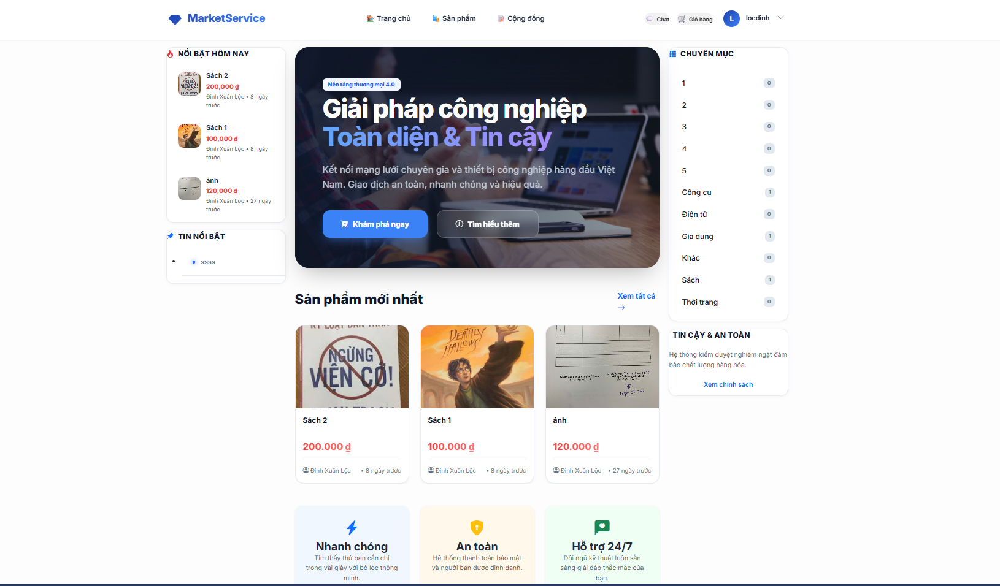
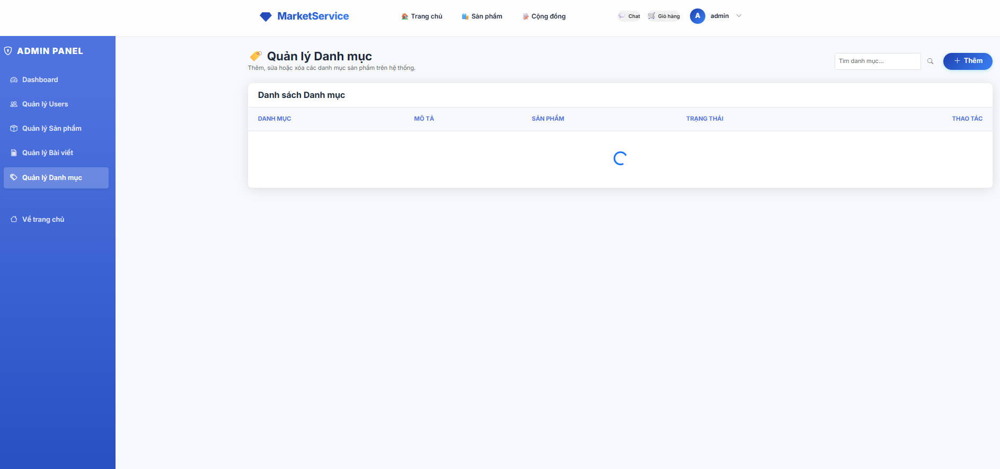

# 💎 MarketService - Premium Marketplace Platform

[](#)
[](#)

**MarketService** là một nền tảng thương mại điện tử hiện đại, tập trung vào trải nghiệm người dùng tối giản và giao diện cao cấp. Dự án được xây dựng trên nền tảng .NET 9 với kiến trúc mạnh mẽ và giao diện Glassmorphism tinh tế.

---

## ✨ Điểm Nổi Bật (Key Features)

- **🚀 Glassmorphism UI**: Giao diện mang phong cách tương lai với hiệu ứng kính mờ, gradient động và animation mượt mà.
- **🔐 Hệ Thống Auth Toàn Diện**: 
  - Đăng nhập linh hoạt bằng Email hoặc Username.
  - Luồng Quên mật khẩu & Reset Password với Token bảo mật (hết hạn sau 1 giờ).
  - Giao diện đăng ký/đặng nhập thiết kế chuyên nghiệp, thân thiện.
- **💸 Marketplace & Orders**: 
  - Quản lý sản phẩm, danh mục sản phẩm động.
  - Hệ thống giỏ hàng, đặt hàng tích hợp quy trình vận chuyển (Shipping).
- **💬 Real-time Chat**: Trao đổi trực tiếp giữa người mua và người bán qua SignalR vô cùng mượt mà.
- **👤 Profile Cá Nhân Hóa**: Trang cá nhân tùy chỉnh ảnh bìa, theo dõi chỉ số uy tín và quản lý giao dịch cá nhân.

---

## 📸 Demo Hình Ảnh (Showcase)

Dưới đây là một số hình ảnh thực tế từ giao diện của dự án:

<<<<<<< HEAD
| Đăng Nhập (Glassmorphism) | Trang Cá Nhân (Profile) |
| :---: | :---: |
|  |  |

=======
### 🏠 Trang Chủ (Home Page)

*Giao diện trang chủ hiện đại với bố cục sản phẩm rõ ràng và đẹp mắt.*

### 🔐 Đăng Nhập (Login Page)

*Hiệu ứng Glassmorphism giúp trang đăng nhập trở nên sang trọng và ấn tượng.*

### 🛠️ Quản Trị (Admin Dashboard)

*Hệ thống quản lý trực quan, giúp người bán và quản trị viên dễ dàng theo dõi dữ liệu.*
>>>>>>> c0fff8a (Fix Category Management and update README images)

---

## 🛠️ Công Nghệ Sử Dụng (Tech Stack)

- **Backend**: C# 13, ASP.NET Core 9.0 (MVC & API)
- **Database**: SQL Server, Entity Framework Core 9.0
- **Frontend**: Vanilla CSS (Custom UI Framework), JavaScript (ES6+), SignalR
- **Security**: JWT Authentication, BCrypt Password Hashing

---

## ⚙️ Hướng Dẫn Cài Đặt (Installation)

1. **Clone repository**:
   ```bash
   git clone https://github.com/Loc2261/MarketService.git
   cd MarketService
   ```

2. **Cấu hình Database**:
   Cập nhật chuỗi kết nối trong `appsettings.json`:
   ```json
   "ConnectionStrings": {
     "DefaultConnection": "Server=YOUR_SERVER;Database=MarketServiceDb;Trusted_Connection=True;MultipleActiveResultSets=true;Encrypt=False"
   }
   ```

3. **Chạy Migration**:
   ```bash
   dotnet ef database update
   ```

4. **Khởi chạy**:
   ```bash
   dotnet run
   ```

---

## 👤 Tác Giả
- **Đinh Xuân Lộc** ([@Loc2261](https://github.com/Loc2261))
- Dự án: **MarketService (Market Server)**

---
*Phát triển với ❤️ bởi Đinh Xuân Lộc.*
