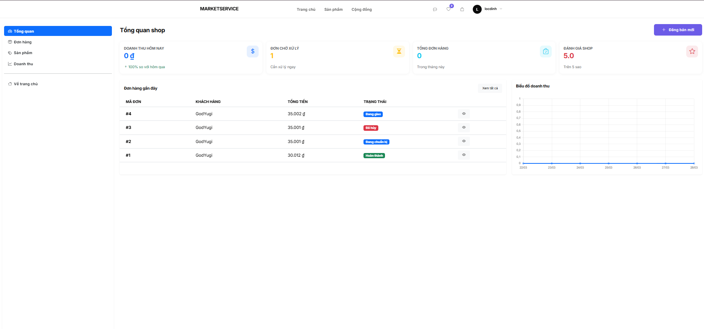

# 💎 MarketService - C2C Online Marketplace Platform

[](#)
[](#)

**MarketService** là một nền tảng thương mại điện tử C2C (Customer-to-Customer) chuyên biệt, giúp mọi người dễ dàng đăng tải, mua bán và trao đổi hàng hóa trực tiếp với nhau. Ứng dụng được xây dựng trên nền tảng .NET 9 với kiến trúc mạnh mẽ kết hợp cùng giao diện người dùng tối giản, hiện đại và cao cấp.

---

## ✨ Điểm Nổi Bật (Key Features)

- **🛒 Sàn Giao Dịch Hàng Hóa (Marketplace)**: 
  - Nơi mọi người dùng đều có thể trở thành người bán hoặc người mua. 
  - Hệ thống đăng sản phẩm chuyên nghiệp, phân loại danh mục tự động.
  - Tích hợp giỏ hàng, quản lý đơn hàng và lưu trữ danh sách yêu thích (Wishlist).
  
- **📰 Khám Phá & Tin Đăng Cộng Đồng (Community Posts)**: 
  - **Khu vực tổng quan tin đăng định kỳ:** Hoạt động như một diễn đàn thu nhỏ, nơi người dùng có thể chia sẻ các bài viết, kinh nghiệm mua sắm, review sản phẩm hoặc chia sẻ các tin rao vặt.
  - Tạo dựng niềm tin và kết nối sâu sắc giữa cộng đồng người mua và người bán.

- **💬 Real-time Chat**: Trao đổi trạng thái đơn hàng, thương lượng giá cả trực tiếp 1-1 qua SignalR vô cùng mượt mà.
- **🚀 Trải Nghiệm Chuẩn Mực**: Giao diện mang đậm tính biên tập (Editorial Style), tối ưu hóa trải nghiệm mượt mà trên nhiều thiết bị.
- **🔐 Hệ Thống Auth Bảo Mật**: Đăng nhập bằng Email/Username cùng luồng xử lý JWT và Token hết hạn an toàn.
- **👤 Quản Lý Uy Tín Gắn Kết**: Trang cá nhân độc quyền, biểu đồ thống kê đơn hàng dành riêng cho môi trường kinh doanh C2C.

---

## 📸 Mô Tả Giao Diện (Showcase)

### 🏠 Trang Chủ (Home Page)

*Nơi hiển thị khu vực thị trường, nổi bật các mặt hàng và giao diện tổng quan đầu tiên của ứng dụng.*

### 📰 Cộng Đồng Thu Nhỏ (Community Feed)

*Khu vực tổng quan tin đăng, là kênh tương tác sôi động giúp cá nhân dễ dàng giao tiếp, cập nhật xu hướng mua sắm.*

### 🔐 Tài Khoản (Login Page)

*Lối vào hệ thống sang trọng cùng hiệu ứng Glassmorphism giúp tạo cảm giác chuyên nghiệp ngay từ điểm chạm đầu tiên.*

### 🛠️ Quản Trị Hệ Thống (Admin Dashboard)

*Trang giám sát toàn diện, giúp Admin dễ dàng phê duyệt danh mục, bài viết, thành viên và các giao dịch diễn ra trên sàn.*

---

## 🛠️ Công Nghệ Sử Dụng (Tech Stack)

- **Backend**: C# 13, ASP.NET Core 9.0 (MVC & API)
- **Database**: SQL Server, Entity Framework Core 9.0
- **Frontend**: Vanilla CSS (Custom UI/Variable System), JavaScript, Bootstrap 5, SignalR
- **Security**: Identity, BCrypt Password Hashing, CSRF Protection

---

## ⚙️ Hướng Dẫn Cài Đặt (Installation)

1. **Clone repository**:
   ```bash
   git clone https://github.com/Loc2261/MarketService.git
   cd MarketService
   ```

2. **Cấu hình Database**:
   Cập nhật chuỗi kết nối trong `appsettings.json`:
   ```json
   "ConnectionStrings": {
     "DefaultConnection": "Server=YOUR_SERVER;Database=MarketServiceDb;Trusted_Connection=True;MultipleActiveResultSets=true;Encrypt=False"
   }
   ```

3. **Chạy Migration**:
   ```bash
   dotnet ef database update
   ```

4. **Khởi chạy máy chủ**:
   ```bash
   dotnet run
   ```

---

## 👤 Tác Giả & Đóng Góp
- **Đinh Xuân Lộc** ([@Loc2261](https://github.com/Loc2261))
- Dự án: **MarketService**

---
*Phát triển với ❤️ bởi Đinh Xuân Lộc.*
